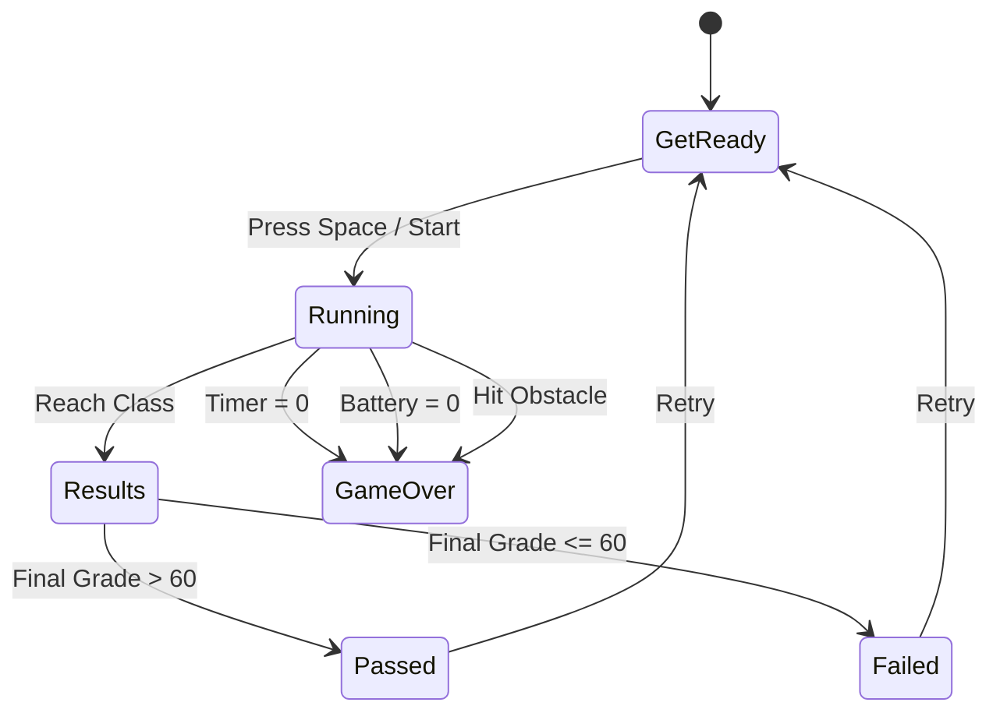
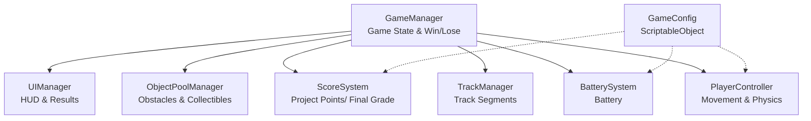

# Game Design Document — Running Late

| Field | Details |
|---|---|
| **Working title** | Running Late |
| **Team** | Noa Vassal, Rotem Adimor |
| **Genre** | Goal-Based 3D Runner |
| **Target platform** | PC |
| **Engine / Unity version** | Unity 6 (6000.3.20f1), URP 3D |
| **Orientation & reference resolution** | Landscape, 1920 × 1080 reference |
| **Expected session length** | Approximately 3 minutes |
| **Document version** | v1.0 — 2026-09-09 |

---

## 1. High Concept

Running Late is a finite runner inspired by Subway Surfers. A computer-science student races along a stylized Jerusalem Boulevard in Jaffa to reach class before the timer expires. The player moves between street zone and trains, jumps and slides around urban obstacles, collects laptop Battery to stay alive, and gathers Project Points that determine the Final Grade shown at the finish.

### Design pillars

1. **Skill Over Progression** — Success depends on reflexes, timing, and reading the path ahead rather than upgrades or permanent bonuses. The player must react correctly to obstacles, lane changes, jumps, and slides while managing the pressure of the class timer.
2. **Meaningful Route Choices** — Different street zones and train paths offer different risks and rewards. Battery pickups, Project Points, obstacles, and time pressure encourage the player to choose between a safer route and a more rewarding one.
3. **Continuous Race to Class** — The game maintains constant forward momentum from the start of the run until the player reaches class or fails. There are no interruptions during gameplay; the timer, increasing obstacle pressure, and visible progress toward the destination keep the run fast and focused.

---

## 2. Reference & Inspiration

- **Primary Reference:** *Subway Surfers* 
  - **Taking:** person running, lane-based movement, jumping, sliding, fast obstacle dodging, and collectible placement.
  - **Not taking:** Character unlocks, hoverboards, shops, currencies, or long-term progression.
- **Secondary Reference:** *Temple Run* 
  - **Taking:** Constant forward movement, third-person perspective, and quick reaction-based obstacle avoidance.
  - **Not taking:** Sharp path turns, branching jungle routes, fantasy themes.
---

## 3. Core Game Loop

**Moment-to-moment rules:**
- **Continuous Movement:** The player runs forward automatically while the environment moves toward the player.
- **Movement:** Use A/D or Arrow Keys to move between lanes, Space/W/Up Arrow to jump, and S/Down Arrow to slide.
- **Battery:** Battery slowly decreases during the run. Battery pickups restore charge. Reaching 0 causes Game Over.
- **Project Points:** The Final Grade is equal to the total Project Points collected at the end of the run. A grade above 60 is a pass; 60 or below is a failure.
- **Goal:** Reach class before the timer expires while collecting enough Battery and Project Points to achieve a passing Final Grade.
- **Failure:** The run fails if the timer reaches 0, Battery reaches 0, the player hits a lethal obstacle, or the player reaches the finish with a Final Grade of 60 or below.

### Parameters you will need to tune

| Parameter | What it controls | First guess |
|---|---|---|
| `baseScrollSpeed` | Speed of the world moving toward the player | 12.0 u/s |
| `laneChangeSpeed` | Speed of movement between lanes | 10.0 u/s |
| `jumpForce` | Height and strength of the player's jump | 7.0 |
| `slideDuration` | How long the player stays in slide mode | 0.8 s |
| `classTimer` | Time available to reach class | 180 s |
| `batteryDrainInterval` | How often Battery decreases | 6 s |
| `batteryPickupValue` | Battery restored by one pickup | +5% |
| `projectPointValue` | Project Points gained from one collectible | +10 |

**Where these live:** Centralized inside a `GameConfig` ScriptableObject and exposed in the Unity Inspector so gameplay values can be adjusted during playtesting without changing code.

**Feel target:** A first-time player should understand lane switching, jumping, and sliding within the first 30 seconds. After a few attempts, the player should be able to reach class with enough Project Points to achieve a Final Grade above 60.

---

## 4. Controls & Input

| Action | Keyboard |
|---|---|
| **Move Left / Right** | A / D or Arrow Keys |
| **Jump** | W / Up Arrow / Spacebar |
| **Slide** | S / Down Arrow |
| **Restart Game** | Enter / Spacebar |

- Input is read during `Update()` and movement using physics is applied during `FixedUpdate()`.

---

## 5. Screens & UI

1. **Title / Start Screen** — Centered game logo ("Running Late"), Play button.

2. **HUD (In-Game)** —
   - Top-Left: Class Timer.
   - Top-Right: Battery percentage.
   - Top-Center: Project Points.
   - *Deliberately absent:* Coins, shop icons, or extra menus during gameplay.

3. **Results Screen** — Displays Final Grade, remaining Battery, Project Points collected, and a prominent "Retry" button. A grade above 60 is a pass; 60 or below is a failure.

- **Canvas setup:** Screen Space – Camera, CanvasScaler *Scale With Screen Size*, reference 1920 × 1080, Match Width/Height = 0.5.

---

## 6. Art & Audio

| Asset | Description / Variants | Source & Licence | Use |
|---|---|---|---|
| **Player Model** | Student character with Run, Jump, Slide, and Hit animations | Custom / Licensed Asset Pack | Player visualization |
| **Environment Assets** | Jerusalem Boulevard streets, buildings, trees, benches, signs, and train elements | Custom / Licensed Asset Pack | Game environment |
| **Obstacle Assets** | Barriers, scooters, bins, benches, and street obstacles | Custom / Licensed Asset Pack | Gameplay hazards |
| **Collectibles** | Battery pickups and Project Point icons | Custom / Licensed Asset Pack | Gameplay collectibles |
| **SFX Pack** | Jump, Slide, Collect and Hit sounds | Freesound.org / CC0 or licensed audio | Audio feedback |

**Licence note:** All visual and audio assets will be either created by the team or taken from properly licensed sources. Asset sources and licences will be documented before submission.

---

## 7. Technical Design

**Scenes:** Single scene setup (`MainGame.unity`). Game reset is handled by the `GameManager` without reloading the scene.

**Packages / Systems Used:** Unity 3D Physics, Universal Render Pipeline (URP), TextMeshPro, Input Manager, Object Pooling, and ScriptableObject configuration.

**Architecture Diagram:**

| Script Name | Single Responsibility |
|---|---|
| `GameManager` | Manages game state, win, failure, and restart. |
| `PlayerController` | Handles lane movement, jumping, sliding, and player physics. |
| `TrackManager` | Controls track segments and progress toward the classroom. |
| `ObjectPoolManager` | Reuses obstacles and collectibles during gameplay. |
| `BatterySystem` | Handles Battery drain and Battery pickups. |
| `ScoreSystem` | Tracks Project Points and sets the Final Grade equal to the total Project Points collected. |
| `UIManager` | Updates the timer, Battery, Project Points, and Results screen. |
| `GameConfig` | Stores editable gameplay values such as speed, jump force, timer, and collectible values. |

### Course Features

1. **Coroutine:** Handle the start countdown, Battery drain, and short UI feedback because these are time-based sequences.

2. **Object Pool:** Reuse recurring obstacles, collectibles, and track segments instead of repeatedly creating and destroying them during the run.

3. **Singleton:** Use `GameManager` as the single manager for the main game state, including start, win, failure, and restart.

4. **Events:** Notify the UI and audio systems when Battery, Project Points, or the game state changes without directly coupling these systems to the player.

5. **ScriptableObject Configuration:** Store gameplay values such as speed, jump force, timer duration, Battery values, and Project Point values so they can be adjusted during playtesting without changing code.

Only features that improve the actual implementation will remain. The architecture may change during development if the prototype shows that a simpler solution works better.
---

## 8. Scope

### 8.1 MVP — Core Playable Game

- [ ] Automatic forward running with lane switching between street zones and train paths.

- [ ] Jumping, sliding, and collision with basic urban obstacles.

- [ ] Class timer with failure when the timer reaches zero.

- [ ] Battery system with passive drain and collectible Battery pickups.

- [ ]  displaying the total Project Points as the Final Grade at the finish.

### 8.2 Polish — Target Course Features

- [ ] Temporary power-ups that give the player special abilities for a few seconds, such as a shield, score multiplier, or Battery protection.

- [ ] More polished Jerusalem Boulevard environment and train visuals.

- [ ] Speed increase or denser obstacle patterns near the end of the run.

- [ ] Improved animations, sound effects, and camera feedback.

### 8.3 Explicitly Out of Scope

- **No Coins or Currency Systems:** No additional currency beyond Project Points.

- **No Shop or Upgrades:** No permanent upgrades or stat progression.

- **No Character Customization:** No skins, costumes, or character selection.

- **No Multiplayer or Online Systems:** No leaderboards, accounts, networking, or cloud saves.

- **No Open World:** The game follows one finite runner route toward the classroom.

---
## Changelog

| Version | Date | Change |
|---|---|---|
| v1.0 | 2026-09-09 | Finalized the initial Game Design Document for *Running Late*. Defined the high concept, references, core game loop, controls, UI, art direction, technical architecture, course features, MVP, polish features, and scope limits. |